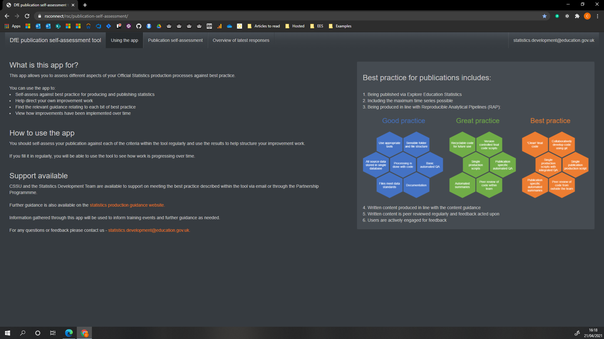
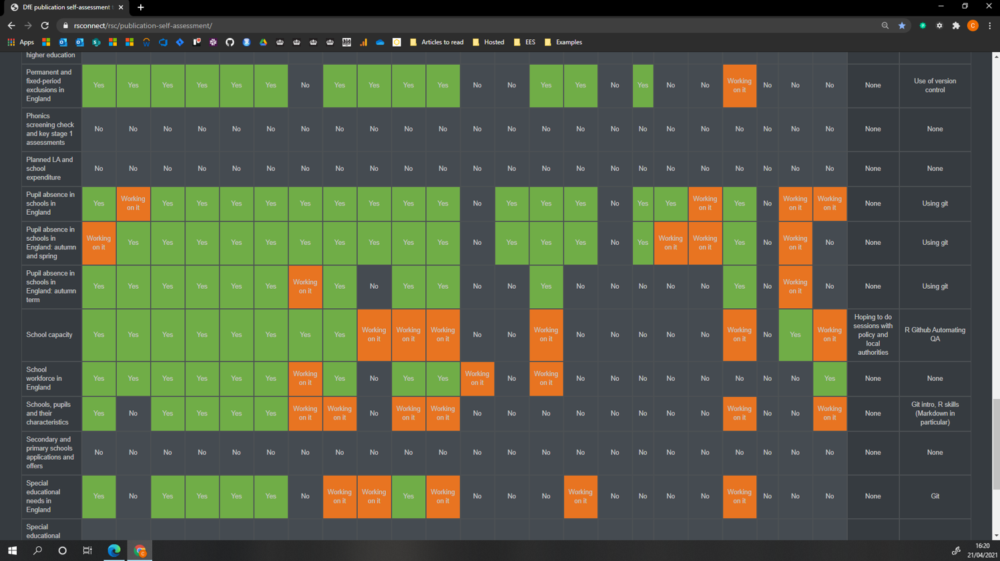

<h1 align="center">
   
  DfE publication self-assessment tool 
   
</h1>

  <a href="#introduction">Introduction</a> |
  <a href="#hosted-environments">Hosted environments</a> |
  <a href="#requirements">Requirements</a> |
  <a href="#how-to-use">How to use</a> |
  <a href="#contributing">Contributing</a> |
  <a href="#contact">Contact</a>

---

## Introduction 

A shiny app to provide a an easy to way to self-assess publications against RAP and other criteria and track progress towards our own RAP levels (based on the cross-government RAP MVP). This shiny app is deployed via the DfE visual studio and rsconnect subscriptions, and is connected to our team's internal SQL database. 

---

## Hosted environments

There are three environments, all accessible to DfE AD:

Production - https://rsconnect/rsc/publication-self-assessment

Pre-production - https://rsconnect-pp/rsc/publication-self-assessment

Development - https://rsconnect-pp/rsc/dev-publication-self-assessment

---

## Requirements

### i. Software requirements 

- Installation of R 3.6.2 or higher

- Installation of RTools40 or higher

### ii. Programming skills required (for editing or troubleshooting)

- R at an intermediate level, [DfE R training guide](https://dfe-analytical-services.github.io/r-training-course/)

  - Particularly [R Shiny](https://shiny.rstudio.com/)
  
### iii. Access

- The source repository, host servers and deployment pipeline are only accessible using DfE kit.

- The SQL database is only accessible to specified DfE users our team's SQL server. 

- If you want to discuss access or would like assistance with setting up your own database or hosting solution feel free to get in touch.

---

## How to use

### Screenshots

Homepage

Self-assessing a publication and seeing individual progress

Dashboard of latest responses across all publications

### Packages

Package control is handled using renv. You will likely need to run `renv::restore()` if this is your first time using the project.

### Deployment

Deployment is handled via the dfe-gov-uk Azure DevOps instance, and deployed to the DfE rsconnect servers.

### Database

The project sends and receives data to an internal SQL database, please get in touch if you want to know more about how this is set up or if you face any issues.

### Tests

There are currently no automated tests on this project, though we hope to add some soon.

---

## Contributing

If you're interested in contributing to this project, get in touch with us and we can arrange access to the source repository in Azure DevOps. The GitHub repo is only a mirror and any changes made directly to it will be overwritten when the next update is mirrored.

---

## Contact

statistics.development@education.gov.uk
